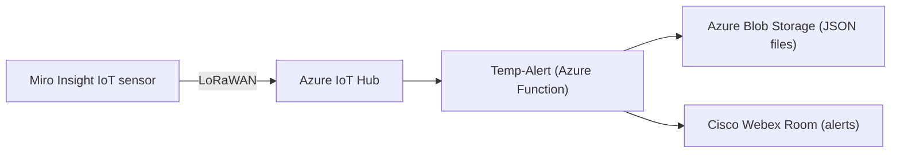

# Temp-Alert

> **Proof of Concept** – simple application for processing IoT telemetry in Microsoft Azure. Storing aquired data to blob storage and send them to Cisco Webex Teams Room.

## ⚙️ Description
Temp-Alert receives device-to-cloud messages from a **Miro Insight** sensor sent via **LoRaWAN** to **Azure IoT Hub**, decodes the payload and then:
- **stores** the full telemetry (temperature, humidity, pressure, …) as JSON blobs in **Azure Blob Storage**  
- **sends** a temperature report message to a **Cisco Webex Room**  

> ⚠️ This is just a sample implementation (Proof of Concept).

---

## 🏗️ Architecture

## 🚀 Requirements
	•	Azure Subscription with:
	•	IoT Hub
	•	Blob Storage (container for JSON data)
	•	Miro Insight LoRaWAN-enabled sensor
	•	Cisco Webex Bot configured for your target room
	•	Python 3.8+

## 🔧 Installation & Deployment
### 1.	Clone the repo

    git clone https://github.com/filippohronsky/temp-alert.git
    cd temp-alert

### 2.	Create a virtual environment & install dependencies
    python -m venv .venv
    source .venv/bin/activate     # Linux / macOS
    .venv\Scripts\activate        # Windows
    pip install -r requirements.txt

### 3.	Configure
Create a .env file in the project root with:

    IOTHUB_CONNECTION_STRING="<your IoT Hub connection string>"
    BLOB_CONNECTION_STRING="<your Blob Storage connection string>"
    WEBEX_ACCESS_TOKEN="<your Webex Bot token>"
    WEBEX_ROOM_ID="<your Webex room ID>"

### 4.	Deploy to Azure
•	Package as an Azure Function (or WebJob/Container)
•	Set the same environment variables under Application Settings

## 🛠️ Usage
+ When your sensor sends a message, Azure IoT Hub routes it into a new blob under your container.
+ The Azure Function triggers on each blob creation, then:
	1. Decodes the incoming base64-encoded payload
	2.	Writes the telemetry JSON to Blob Storage
+ Posts a formatted temperature alert to your Cisco Webex Room, for example:
	+ ℹ️ **Teplota:** {temperature} **, Vlhkosť:** {humidity} **, CO2:** {co2} **, IAQ:** {iaq} **, Tlak:** {pressure} **, Napätie batérie:** {battery_v}
